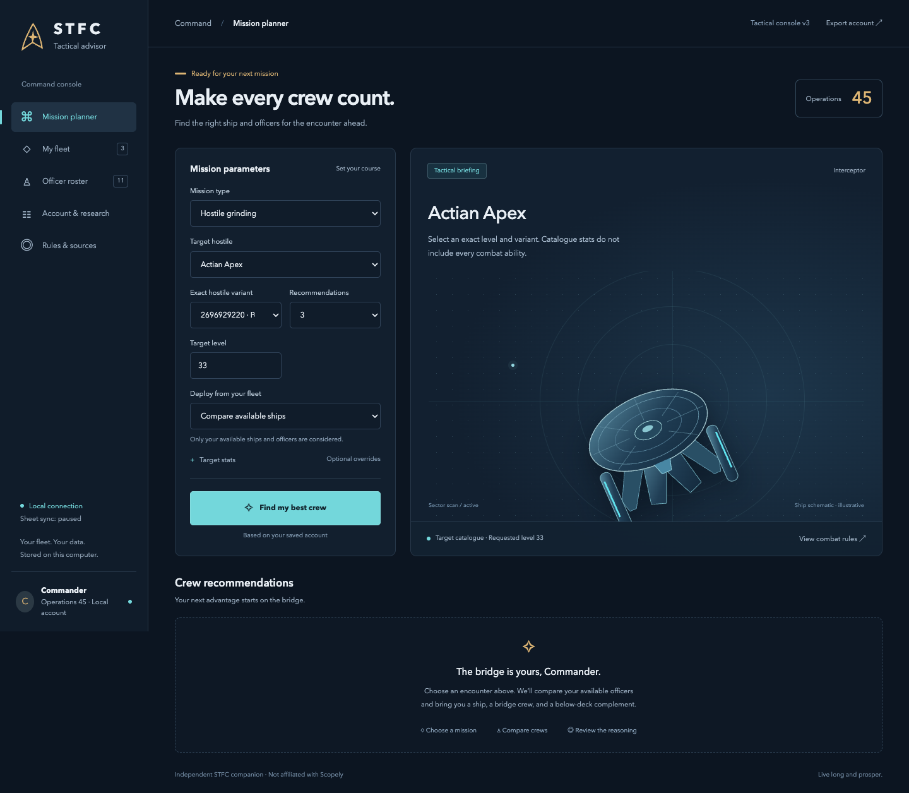
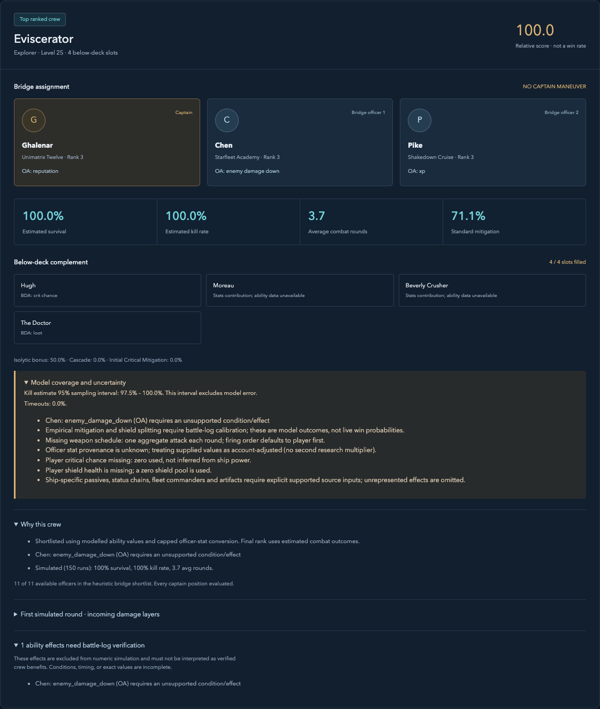
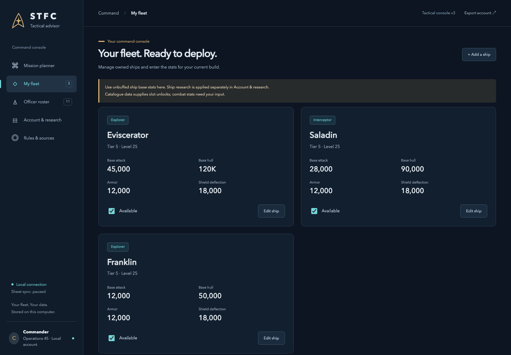
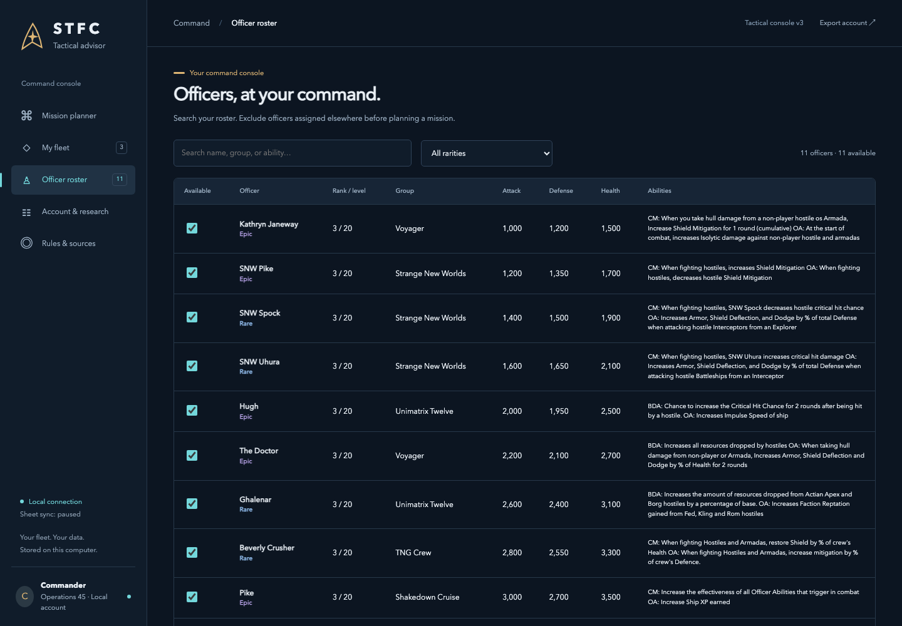
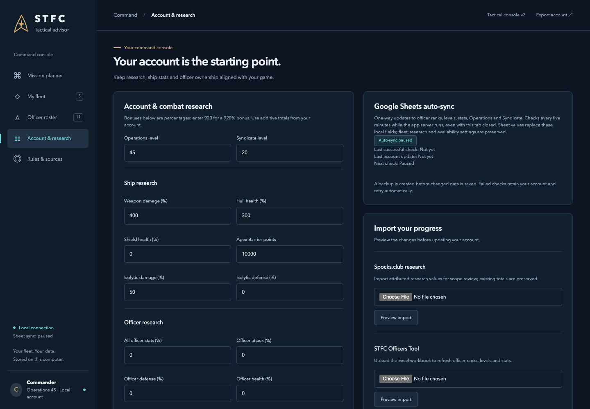

# STFC Tactical Advisor

[](https://github.com/AnjaBuckley/STFC_TacticalAdvisor/actions/workflows/windows-build.yml)

A local tactical console for **Star Trek Fleet Command**. Compare ships, bridge crews and below-deck assignments using your officer roster, fleet and supported research totals. See the reasoning behind each recommendation and keep your officer progress up to date through Google Sheets.

**[Get the Windows build](https://github.com/AnjaBuckley/STFC_TacticalAdvisor/actions/workflows/windows-build.yml)** · [Setup and packaging](packaging/BUILD_WINDOWS.md) · [Mechanics and limitations](docs/RULES.md) · [Contributor instructions](AGENTS.md)



*Screenshots show the running app with [synthetic demo data](docs/demo-profile.json). Ship builds, officer stats, target overrides and account levels are illustrative, not verified game values or a real player's account.*

## Start on Windows 11

No Python installation is needed for the portable app.

1. Open the **[Windows portable app workflow](https://github.com/AnjaBuckley/STFC_TacticalAdvisor/actions/workflows/windows-build.yml)** and select a successful run.
2. Download the **STFC-Advisor-Windows-x64** artifact. GitHub requires you to be signed in. Extract the download to find `STFC-Advisor-Windows-x64.zip`.
3. Extract that inner ZIP completely, then open **STFC-Advisor.exe** in the extracted folder.
4. The console opens in your default browser. In **Account & research**, import your officer workbook or connect your shared Officers Tool sheet. Add your owned ships in **My fleet**.
5. Optionally run **Create-Desktop-Shortcut.vbs** from the app folder to add a desktop shortcut.

The tray icon near the Windows clock offers **Open app**, **Open data and logs**, and **Quit**. Closing the browser keeps the app running; **Quit** stops it. Launching the EXE again opens the existing instance. The app does not add itself to Windows startup.

The package starts with a blank account. The officer sheet does **not** import your owned-ship inventory. A previously exported account JSON can also be restored in Account & research.

The build is unsigned. Automated Windows checks cover startup, API/assets and duplicate launches; tray appearance needs a separate check on a Windows 11 desktop. See [the included user guide](packaging/START-HERE.txt).

## What the app does

| Area | What you can do |
| --- | --- |
| Mission planner | Choose hostile grinding, PvP, base hitting, station raids, solo/duo waves, Academy drones, anomalies or dreadnoughts. Compare available ships and supply target-stat overrides. |
| Crew recommendations | Compare captain, bridge and below-deck assignments, estimated combat outcomes, ability coverage and reasoning. Export results as JSON. |
| My fleet | Add ships from the local catalogue, enter build stats and slot counts, and mark ships unavailable. |
| Officer roster | Search and filter officers, inspect imported ranks/stats, and exclude officers assigned elsewhere. |
| Account & research | Edit supported totals, review attributed research sources, preview CSV/XLSX/JSON imports, and manage Google Sheets auto-sync. |
| Rules & sources | Inspect sources, supported mechanics, estimates and known gaps in the model. |

PvP estimates require opponent hull health and damage inputs; enter shield health separately. Catalogue targets require an exact level and variant ID when several variants match. Wave, station and event modes estimate an individual encounter; they do not simulate a whole fleet, station or wave sequence.

## A closer look

| Crew recommendation | Owned fleet |
| --- | --- |
| [](docs/screenshots/recommendations.png) | [](docs/screenshots/fleet.png) |

| Officer roster | Account and sync settings |
| --- | --- |
| [](docs/screenshots/roster.png) | [](docs/screenshots/account.png) |

[Mobile planner screenshot](docs/screenshots/mobile-planner.png) · [How to regenerate these screenshots](docs/screenshots/README.md).

## Google Sheets syncing

Paste an **STFC Officers Tool** Google Sheet link in Account & research and select **Enable auto-sync**. The sheet must permit **Anyone with the link → Viewer** access. This integration does not use Google login credentials and cannot read a private sheet through your browser login.

- **Direction:** Google Sheets → this local app. It never writes to the sheet or your in-game account.
- **Frequency:** immediately when enabled, then every five minutes while the server is running and the PC is awake and online. The browser can be closed.
- **Updated fields:** officer ranks, levels, stats and details, plus Operations and Syndicate levels. Sheet values replace those local fields.
- **Preserved fields:** ships, research, officer availability and manual officer enrichments. Officers missing from the sheet are retained.
- **Controls:** pause/resume, sync now, last successful check and next check. The connection persists across launches.
- **Save behavior:** changed data creates a backup before saving; unchanged data does not rewrite the profile. Failed downloads leave the saved account intact and retry on the next check.

If a sync changes the account while you are editing, a reload notice appears. Unsaved form inputs are not silently replaced; stale saves are rejected. Reload the account and regenerate recommendations to use the latest values.

## Data, privacy and updates

The service binds to `127.0.0.1`. Apart from an explicitly connected Google Sheet, normal use does not require a hosted backend. Profile changes use revision checks, timestamped backups and atomic saves.

| Run mode | Writable data location |
| --- | --- |
| Windows portable app | `%LOCALAPPDATA%\STFC Advisor\profiles` |
| Source checkout | `profiles/` in the checkout |
| Isolated test/demo | The directory specified by `STFC_ADVISOR_DATA_DIR` |

The data folder holds the account, saved sheet connection, backups and rotating logs. **Open data and logs** in the Windows tray menu opens it. Quit the app before replacing the extracted application folder with a newer build; the separate data directory is retained.

`.gitignore` excludes accounts, connections, credentials, runtime files and build output. Only the blank profile template/schema and explicitly reviewed documentation screenshots are tracked. Use synthetic data for screenshots and public bug reports. Static game metadata is separate from player-owned progress.

## Run from source

Requires **Python 3.11+**; Windows distribution builds use **Python 3.12 x64**. The interface is plain HTML, CSS and JavaScript served by FastAPI. There is no Streamlit runtime or Node build step.

```sh
git clone https://github.com/AnjaBuckley/STFC_TacticalAdvisor.git
cd STFC_TacticalAdvisor
```

**macOS / Linux**

```sh
python3 -m venv .venv
.venv/bin/python -m pip install -r requirements.txt
.venv/bin/python run_app.py
```

**Windows PowerShell**

```powershell
py -3.12 -m venv .venv
.venv\Scripts\python.exe -m pip install -r requirements.txt
.venv\Scripts\python.exe run_app.py
```

The launcher opens the browser once the server is ready. It prefers port 8000 and chooses another available port if needed. `--no-browser` suppresses opening a tab; `--headless` also disables the Windows tray. Use `--port 8001` to choose another preferred port or `--port 0` to request an unused one.

The CLI is available through `python main.py --help`. For a portable Windows build, double-click `Build-Windows.cmd` on a Windows build PC, or run the GitHub workflow. [Full build instructions](packaging/BUILD_WINDOWS.md).

## Accuracy and scope

This is a **heuristic advisor, not a complete STFC combat simulator**. It evaluates captain positions within a shortlist and simulates finalists; it does not prove a global optimum. Scores and simulation outcomes are estimates, not measured live win probabilities.

The model includes capped officer-to-ship stat conversion, separate hull/shield pools, scoped and selected timed officer effects, weapon schedules, standard mitigation, separate Isolytic/Cascade values, Apex and Critical Mitigation. Missing schedules use a disclosed aggregate attack. Some formulas, stacking and event timing remain provisional; full status chains, ship passives, station platforms and multi-wave persistence are incomplete. Sampling intervals exclude model error. Battle-log calibration is still needed.

Read [the mechanics audit and primary sources](docs/RULES.md) before relying on a numerical prediction. The in-app rules view and recommendation warnings disclose unsupported effects.

## Contributing

Read **[AGENTS.md](AGENTS.md)** for architecture, invariants and development guidance. **[CLAUDE.md](CLAUDE.md)** points Claude Code to the same shared instructions.

With the development environment active:

```sh
python -m pytest -q
python -m ruff check path/to/changed_file.py
node --check web/app.js
python packaging/smoke_bundle.py run_app.py
```

Node is only needed for the optional JavaScript syntax check. The launcher tests need localhost socket access. Use temporary profiles for mutation tests. For mechanics changes, include a primary source, update the rules audit and add a behavior regression. For UI changes, check desktop and phone layouts and update affected demo screenshots.

### Repository layout

```text
app.py / service.py       API, validation and account persistence
run_app.py                User-facing launcher
desktop_launcher.py       Tray, instance lock, browser and logging
sheet_sync.py             Five-minute Google Sheet polling
web/                      Browser interface
engine/ / optimizer/      Combat estimates and crew ranking
ingest/                   CSV and workbook imports
data/                     Static game metadata and rule coverage
profiles/                 Blank template, schema and ignored local data
tests/                    Behavior regression tests
packaging/                Windows build and executable smoke checks
docs/ / tools/            Mechanics audit, demo data and screenshot capture
```

Independent fan project; not affiliated with Scopely or the Star Trek rights holders. Game names and assets remain the property of their respective owners.

## September 2026 mechanics corrections

Read [the implementation disposition](docs/AUDIT_CORRECTIONS.md) and [calculation conventions](docs/RULES.md) before interpreting results. Select an exact hostile variant; enter hull and shield health separately. Officer-sheet values are treated as already adjusted for the account. Research imports preserve attributed source values for review instead of guessing global buffs. The app shows model omissions and uncertainty; wave, raid and anomaly predictions cover individual encounters only.

### Combat or loot priority

The mission planner can rank combat outcomes or include supported hostile loot bonuses. Loot priority still puts kill/survival feasibility first; it does not simulate travel, cargo or full-flight yield. Borg officer-stat bonuses, Trip/Archer received-weapon effects and selected Explorer PvP morale effects are now modelled. See [mechanics and remaining assumptions](docs/RULES.md). API requests accept `objective: "combat"` (default) or `"loot"`; loot is unavailable for PvP/station encounters.
